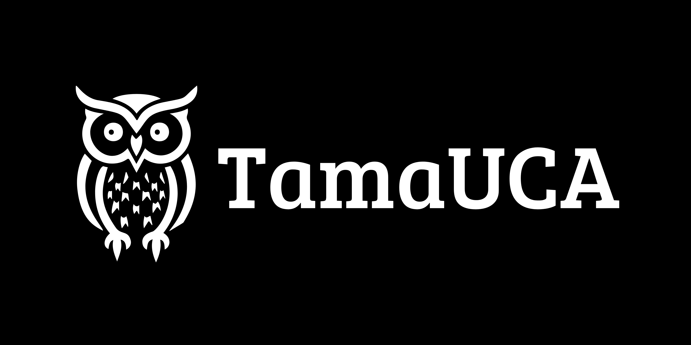

[](https://classroom.github.com/a/mi1WNrHU)

# Proyecto de C++ - [TamaUCA]



## Descripción del Proyecto

TamaUCA es un juego al estilo de _Tamagotchi_ inspirado en la UCA donde cuidas a tu mascota virtual. Mantén sus necesidades y diviértete con minijuegos para mantenerla feliz y saludable.

## Equipo

- **Nombre del equipo:** cin >> ganas;

### Integrantes del equipo

1. **Nombre completo:** Diego Roberto Olivares Ortega
   **Carnet:** 00087525

2. **Nombre completo:** Mauricio Rene Rodas Lazo
   **Carnet:** 00019625

3. **Nombre completo:** Amy Giselle Torres Ventura
   **Carnet:** 00085025

4. **Nombre completo:** Diego Sebastian Villacorta Villalobos
   **Carnet:** 00177525

## Instrucciones de Ejecución

1. Clona este repositorio en tu máquina local:

   ```bash
   git clone [https://github.com/FDP-01-2025/project-cin-ganas.git]
   ```

2. Ingresa en el folder del proyecto

   ```bash
   cd project-cin-ganas
   ```

3. Compila el programa

   ```bash
   g++ main.cpp -o main
   ```

4. Ejecuta el programa
   ```bash
   ./main
   ```
