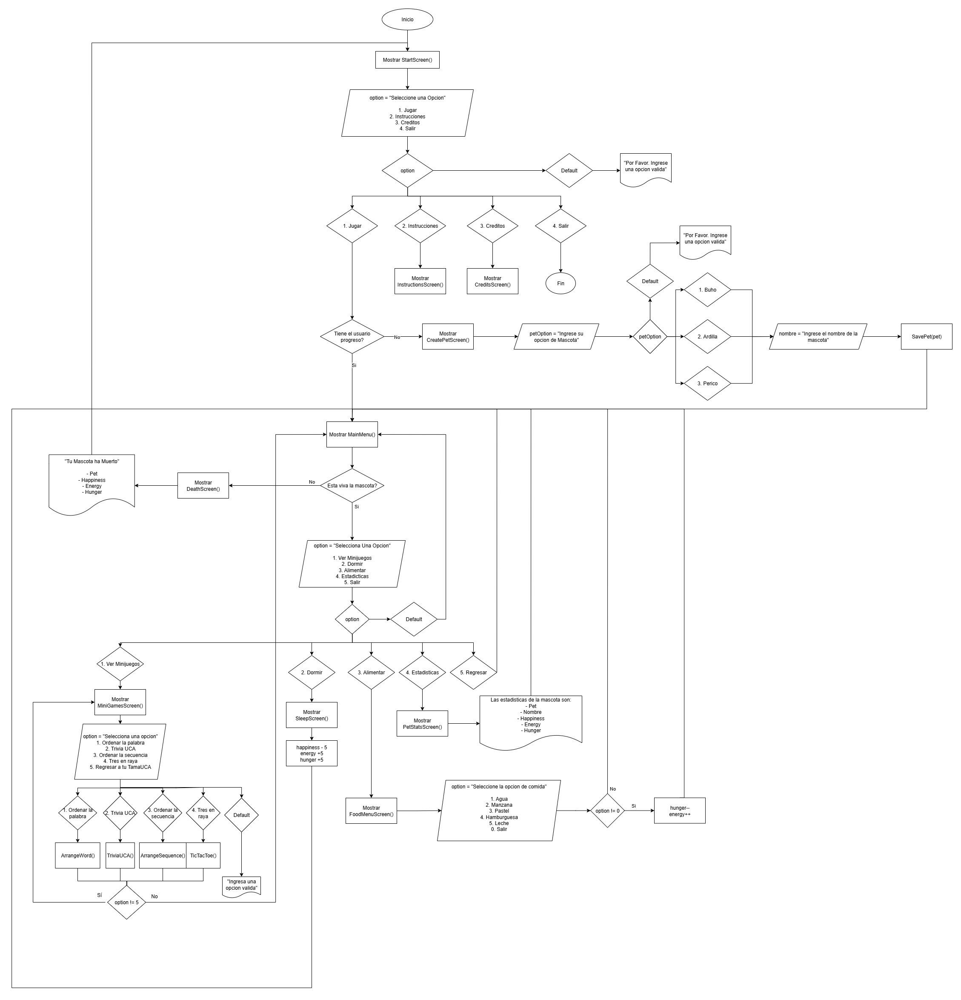

[](https://classroom.github.com/a/mi1WNrHU)

# Proyecto de C++ - [TamaUCA]


## Descripción del Proyecto

Bienvenido a **TamaUCA**! Un juego al estilo de un clásico _Tamagotchi_ inspirado en la _Universidad Centroamericana “José Simeón Cañas”_. Adopta a tu propia mascota virtual y cuídala; hazla dormir, aliméntala, y juega con ella una serie de minijuegos inspirados en la UCA. No la dejes de cuidar… o la podrás perder para siempre.

### Temática y Ambientación

El juego esta ambientado en el campus de la _Universidad Centroamericana “José Simeón Cañas”_, esto se puede evidenciar tanto con las mascotas, las cuales representan animales representativos de la universidad, por ejemplo, el búho, el cual forma parte de la identidad de la UCA, la ardilla y el perico, los cuales son animales que se pueden encontrar fácilmente por el campus, como con los minijuegos.

Por ejemplo, en _Trivia UCA_ se responden preguntas sobre la universidad; en UCAGrama se deben organizar letras para formar términos relacionados con la UCA; y en _Memo-Owl_, el jugador ayuda al búho a superar una materia de su carrera, integrando así elementos propios de la vida estudiantil universitaria.

### Mecánica Principal

El jugador debe adoptar una mascota virtual y nombrar una mascota virtual, a partir de ahí debe de gestionar inteligentemente su bienestar eligiendo acciones del menú. Cada decisión como alimentar, dormir, o jugar impacta en los distintos niveles de la mascota, creando un ciclo constante de cuidado. Al jugar y ganar en un minijuego el usuario obtiene monedas, las cuales las puede canjear por alimentos los cuales impactan positivamente en su salud y energía. El reto es mantener a la mascota sana y feliz el mayor tiempo posible, evitando que alguno de sus indicadores llegue a cero. Además, tienes que estar pendiente de ella, pues si pasa mucho tiempo y no juegas con ella la puedes perder.

### Idea General de la Jugabilidad

A continuación, se detalla la idea general de la jugabilidad. Se explica desde cómo el jugador adopta y nombra a su mascota virtual, hasta las diferentes opciones que puede tomar, y como afectan estas a la mascota y a la jugabilidad.

1. Al iniciar el juego, se muestra una pantalla inicial donde el jugador puede elegir entre visualizar las instrucciones, consultar los créditos o seleccionar directamente la opción “Jugar” para comenzar la experiencia.

2. En dado caso sea la 1ra vez que el jugador abre el juego se mostrará una ventana donde se le pedirá crear su mascota, el jugador deberá escoger la mascota e ingresar el nombre de esta. En dado caso que no sea la 1ra vez, directamente el jugador podrá acceder al menú principal.

3. En el menú principal el jugador tendrá diferentes opciones:
   - Jugar a los minijuegos: Muestra el menú con los diferentes minijuegos
   - Dormir: Hace descansar a la mascota.
   - Comer: Dirige al jugador a una tienda con diferentes productos.
   - Ver Estadísticas: Muestra los detalles de la mascota (Energía, hambre, felicidad)
   - Salir: Guarda el progreso y regresa a la pantalla de inicio.

**Minijuegos**

- **UCAGrama:** Tienes que ordenar la palabra en base a una serie de letras desordenadas.

| **Resultado** | **Efecto**                                                      |
| ------------- | --------------------------------------------------------------- |
| **Victoria**  | Monedas: +7 <br> Felicidad: +7 <br> Hambre: +3 <br> Energía: -3 |
| **Derrota**   | Monedas: +0 <br> Felicidad: +0 <br> Hambre: +5 <br> Energía: -5 |

- **TriviaUCA:** Tienes que responder preguntas de opción múltiple de forma correcta.

| **Resultado**              | **Efecto**                                                        |
| -------------------------- | ----------------------------------------------------------------- |
| **3 Respuestas Correctas** | Monedas: +10 <br> Felicidad: +10 <br> Hambre: +3 <br> Energía: -3 |
| **2 Respuestas Correctas** | Monedas: +7 <br> Felicidad: +7 <br> Hambre: +5 <br> Energía: -5   |
| **1 Respuesta Correcta**   | Monedas: +5 <br> Felicidad: +5 <br> Hambre: +7 <br> Energía: -7   |
| **0 Respuestas Correcta**  | Monedas: +0 <br> Felicidad: +0 <br> Hambre: +10 <br> Energía: -10 |

- **Memo-Owl:** Se te da una secuencia de números aleatorios y tienes que memorizarlos para posteriormente escribirlos en el orden correcto.

| **Resultado** | **Efecto**                                                      |
| ------------- | --------------------------------------------------------------- |
| **Victoria**  | Monedas: +7 <br> Felicidad: +7 <br> Hambre: +3 <br> Energía: -3 |
| **Derrota**   | Monedas: +0 <br> Felicidad: +0 <br> Hambre: +7 <br> Energía: -7 |

- **Tres en raya:** El dueño del juego es el jugador con las X. Gana forma una línea de X’s.

| **Resultado**         | **Efecto**                                                      |
| --------------------- | --------------------------------------------------------------- |
| **Gana el Jugador X** | Monedas: +7 <br> Felicidad: +7 <br> Hambre: +3 <br> Energía: -3 |
| **Gana el Jugador 0** | Monedas: +0 <br> Felicidad: +0 <br> Hambre: +5 <br> Energía: -5 |

**Comer**
Los diferentes productos disponibles que se encuentran en la tienda son:

| **Opción** | **Comida**  | **Efecto**     | **Precio** |
| ---------- | ----------- | -------------- | ---------- |
| 1          | Agua        | +3 de Energía  | 3          |
| 2          | Manzana     | -3 de Hambre   | 5          |
| 3          | Pastel      | -10 de Hambre  | 15         |
| 4          | Hamburguesa | +10 de Energía | 20         |
| 5          | Leche       | +20 de Energía | 30         |
| 0          | Salir       |                |            |

**Dormir**
El efecto que el realizar la acción de dormir en la mascota es el siguiente:

| **Atributo** | **Efecto** |
| ------------ | ---------- |
| Energía      | +5         |
| Hambre       | +5         |
| Felicidad    | -5         |

4. Como has podido observar cada decisión que tomes tendrá un efecto en tu mascota. No debes dejar que la energía o la felicidad llegue a 0, o que el hambre llegue a 100. En dado caso que así sea tu mascota morirá, mostrándote así el juego una pantalla de muerte con las estadísticas finales de tu mascota.

5. Debes tener en cuenta que, si dejas de jugar a TamaUCA por un tiempo, estarás descuidando a tu mascota, lo que provocará que sus atributos se vean afectados negativamente.

### Aplicación de los temas vistos

A continuación, se detalla la implementación de los distintos contenidos vistos dentro del juego.

| **Contenido**                                    | **Descripción**                                                                                                  | **Ejemplo**                                                                                                                                                                                                                                                                                                                                                                                                                                     |
| ------------------------------------------------ | ---------------------------------------------------------------------------------------------------------------- | ----------------------------------------------------------------------------------------------------------------------------------------------------------------------------------------------------------------------------------------------------------------------------------------------------------------------------------------------------------------------------------------------------------------------------------------------- |
| **Variables y tipos de datos**                   | Se utilizan variables para almacenar y controlar los distintos atributos de la mascota.                          | `string pet; string name;`                                                                                                                                                                                                                                                                                                                                                                                                                      |
| **Estructuras condicionales (if, else, switch)** | Permiten tomar decisiones en el juego, como verificar si la mascota ha muerto o seleccionar opciones del menú.   | `cpp<br>if (p.energy <= 0 && p.happiness <= 0 && p.hunger >= 100) {<br>    p.isAlive = false;<br>    Save(p);<br>    showDeathScreen(p);<br>}`                                                                                                                                                                                                                                                                                                  |
| **Ciclos (for, while, do while)**                | Se utilizaron para facilitar la repetición de procesos, por ejemplo, durante la validación de entradas de datos. | `cpp<br>do {<br>    cout << "Ingresa un nombre para tu mascota:\n";<br>    getline(cin, petName);<br>    if (petName.empty()) {<br>        cout << "Por favor. Ingresa un nombre para tu mascota\n";<br>    }<br>} while (petName.empty());`                                                                                                                                                                                                    |
| **Funciones**                                    | Se utilizaron para modularizar el proyecto, separando funcionalidades como jugar, dormir, ver estadísticas, etc. | `cpp<br>void SleepOption(Pet &p) {<br>    p.energy += 5;<br>    p.hunger += 5;<br>    p.happiness -= 5;<br><br>    if (p.energy > 100) p.energy = 100;<br>    if (p.energy < 0) p.energy = 0;<br>    if (p.hunger > 100) p.hunger = 100;<br>    if (p.hunger < 0) p.hunger = 0;<br>    if (p.happiness > 100) p.happiness = 100;<br>    if (p.happiness < 0) p.happiness = 0;<br><br>    Save(p);<br>    Sleep(5000);<br>    MainMenu(p);<br>}` |
| **Manejo de archivos**                           | Se usó para guardar y recuperar el progreso del juego mediante la escritura y lectura de un archivo `.txt`.      | `cpp<br>void Save(const Pet &p) {<br>    ofstream savefile("save.txt");<br>    savefile << p.pet << "\n";<br>    // ... otros datos<br>    savefile.close();<br>}`                                                                                                                                                                                                                                                                              |
| **Manejo de errores**                            | Se utilizó para validar entradas de usuario, asegurando que los datos ingresados sean correctos.                 | `cpp<br>int validateInt() {<br>    while (true) {<br>        cin >> value;<br>        if (cin.fail()) {<br>            cin.clear();<br>            cin.ignore(numeric_limits<streamsize>::max(), '\n');<br>            cout << "Entrada invalida.";<br>        } else {<br>            cin.ignore(numeric_limits<streamsize>::max(), '\n');<br>            return value;<br>        }<br>    }<br>}`                                            |
| **Interfaz por consola**                         | Toda la interacción se realiza por consola, usando arte ASCII para mejorar la experiencia visual del jugador.    | ``````                                                                                                                                                                                                                                                                                                                                                                                                                                          |

### Imágenes o mockups del juego

A continuación, se presentan las imágenes y mockups que ilustran el diseño visual del juego. Estos representan las distintas pantallas con las que el jugador interactuará. El diseño de los Mockups fue realizado en Figma y se puede acceder por medio del siguiente link.

**Link de los Mockups en Figma:** [Figma](https://www.figma.com/design/rKoGT6qOcsnSLGgRMj7Fq5/FDP?node-id=0-1&t=7InViNUeDhsNxthC-1)

### Flujograma general del proyecto

A continuación, se muestra el flujograma general del proyecto.



## Equipo

- **Nombre del equipo:** cin >> ganas;

### Integrantes del equipo

1. **Nombre completo:** Diego Roberto Olivares Ortega
   **Carnet:** 00087525

2. **Nombre completo:** Mauricio Rene Rodas Lazo
   **Carnet:** 00019625

3. **Nombre completo:** Amy Giselle Torres Ventura
   **Carnet:** 00085025

4. **Nombre completo:** Diego Sebastian Villacorta Villalobos
   **Carnet:** 00177525

## Instrucciones de Ejecución

1. Clona este repositorio en tu máquina local:

   ```bash
   git clone https://github.com/FDP-01-2025/project-cin-ganas.git
   ```

````

2. Ingresa en el folder del proyecto

   ```bash
   cd project-cin-ganas
   ```

3. Compila el programa

   ```bash
   g++ src/util/*.cpp src/pet/*.cpp src/UI/*.cpp src/minigames/*.cpp main.cpp -o main
   ```

4. Ejecuta el programa
   ```bash
   ./main
   ```
````
